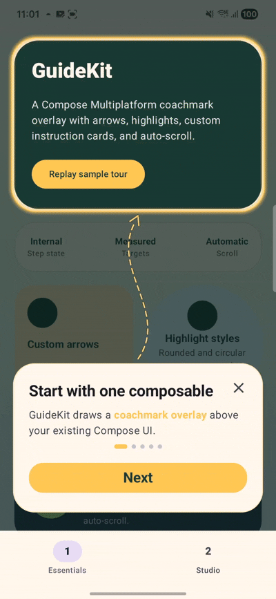

<p align="center">
  
</p>

<p align="center">
  <strong>Beautiful coach marks for Compose Multiplatform</strong>
</p>

<p align="center">
  Build polished product tours, onboarding flows, spotlight overlays, smart arrows, instruction cards, and automatic scrolling in Kotlin Compose.
</p>

<p align="center">
  <a href="https://central.sonatype.com/search?q=guidekit"></a>
  
  
  
  
</p>

<p align="center">
  <a href="https://tharukack.github.io/guidekit/"><strong>Website</strong></a> ·
  <a href="#installation">Installation</a> ·
  <a href="#quick-start">Quick Start</a> ·
  <a href="#customization">Customization</a> ·
  <a href="#features">Features</a> ·
  <a href="#platform-support">Platform Support</a>
</p>

<p align="center">
  
</p>

---

## Live Demo

<p align="center">
  
  &nbsp;&nbsp;&nbsp;
  
</p>

---

## Installation

Add GuideKit to the Compose Multiplatform source set where you want to show tours.

```kotlin
implementation("io.github.tharukack:guidekit:0.1.1")
```

For Kotlin Multiplatform projects:

```kotlin
kotlin {
    sourceSets {
        commonMain.dependencies {
            implementation("io.github.tharukack:guidekit:0.1.1")
        }
    }
}
```
---

## Quick Start

Add GuideKit to the **main composable that occupies the full screen**. It does not matter whether your screen uses a `Scaffold`, a `Box`, or another layout. The guide should be placed at the screen's top level so it can draw above all of its content.

### 1. Keep the external values in the parent screen

Store the measured bounds of the composable you want to highlight. This minimal example uses `rememberSaveable` for guide visibility, but you can use any persistence approach you prefer, such as a ViewModel backed by DataStore or a database, to prevent completed guides from appearing again.

```kotlin
var targetBounds by remember { mutableStateOf<Rect?>(null) }
var showGuide by rememberSaveable { mutableStateOf(true) } // Replace with your persistence update if needed.
```

### 2. Measure the UI you want to highlight

Pass a bounds callback into the child composable that contains the target. Attach `onGloballyPositioned` to the target itself and send its measured bounds back through that callback.

```kotlin
@Composable
fun MainScreenContent(
    onTargetBoundsChanged: (Rect?) -> Unit,
    modifier: Modifier = Modifier,
) {
    Column(modifier) {
        Button(
            onClick = { /* Your action */ },
            modifier = Modifier.onGloballyPositioned { coordinates ->
                onTargetBoundsChanged(coordinates.boundsInRoot())
            },
        ) {
            Text("Create item")
        }
    }
}
```

### 3. Place GuideKit at the full-screen parent level

Place `GuideKit` in the full-size parent composable, after the screen content. The parent owns `targetBounds` and passes its update callback into `MainScreenContent`. This lets a target inside any nested composable send its bounds to the parent without moving the target itself.

```kotlin
@Composable
fun MainScreen() {
    var targetBounds by remember { mutableStateOf<Rect?>(null) }
    var showGuide by rememberSaveable { mutableStateOf(true) }

    Box(Modifier.fillMaxSize()) {
        MainScreenContent(
            onTargetBoundsChanged = { bounds -> targetBounds = bounds },
            modifier = Modifier.fillMaxSize(),
        )

        if (showGuide) {
            GuideKit(
                steps = listOf(
                    GuideKitStep(
                        targetBounds = targetBounds,
                        title = "Create your first item",
                        description = "Tap here to start a new workflow.",
                        arrowConfig = GuideKitArrowConfig(
                            from = GuideKitAnchor.TopRight, // instruction box connection point
                            to = GuideKitAnchor.BottomCenter, // target connection point
                        ),
                    ),
                ),
                onSkipped = { showGuide = false },
                onFinished = { showGuide = false },
                modifier = Modifier.fillMaxSize(),
            )
        }
    }
}
```

See the [`sample`](sample/) app for full configuration, styling, auto-scroll, arrow variants, rounded highlights, and circular highlights.

---

## Customization

### Customization catalogue

| Area | What you can configure |
| --- | --- |
| [Multiple steps](#add-multiple-steps) | Add targets and control the order of the tour. |
| [Global and step-specific styles](#global-styles-and-step-specific-styles) | Set shared visual defaults and override individual steps. |
| [Step text](#customize-step-text) | Customize titles, descriptions, highlighted phrases, and button labels. |
| [Arrows](#customize-arrows) | Configure anchors, line patterns, curves, strokes, and arrowheads. |
| [Target highlights](#customize-the-target-highlight) | Configure shapes, cutouts, padding, glows, and borders. |
| [Instruction cards](#customize-the-instruction-card) | Configure placement, size, shape, colors, borders, and shadows. |
| [Automatic scrolling](#configure-automatic-scrolling) | Keep highlighted targets visible around the instruction card. |
| [Navigation and callbacks](#configure-navigation-and-callbacks) | Configure progress, starting step, skip, finish, and analytics callbacks. |

### Add multiple steps

Add one `GuideKitStep` for each composable you want to highlight. Every step receives the bounds measured from its own target composable, and the order of the list determines the order of the tour. GuideKit automatically handles next, previous, and finish navigation.

The following example creates a three-step guide. `createButtonBounds`, `activityCardBounds`, and `profileButtonBounds` are measured and sent to the parent using the same callback pattern shown in the Quick Start.

```kotlin
val guideSteps = listOf(
    GuideKitStep(
        targetBounds = createButtonBounds,
        title = "Create your first item",
        description = "Tap here to start a new workflow.",
        arrowConfig = GuideKitArrowConfig(
            from = GuideKitAnchor.TopRight,
            to = GuideKitAnchor.BottomCenter,
        ),
    ),
    GuideKitStep(
        targetBounds = activityCardBounds,
        title = "Track your progress",
        description = "Your latest activity and important updates appear here.",
        arrowConfig = GuideKitArrowConfig(
            from = GuideKitAnchor.BottomLeft,
            to = GuideKitAnchor.TopCenter,
        ),
    ),
    GuideKitStep(
        targetBounds = profileButtonBounds,
        title = "Make it yours",
        description = "Open your profile to customize your experience.",
        arrowConfig = GuideKitArrowConfig(
            from = GuideKitAnchor.TopRight,
            to = GuideKitAnchor.CenterLeft,
        ),
    ),
)

GuideKit(
    steps = guideSteps,
    onSkipped = { showGuide = false },
    onFinished = { showGuide = false },
    modifier = Modifier.fillMaxSize(),
)
```

### Global styles and step-specific styles

Use `GuideKitStyle` to define the visual defaults for the entire guide. A step inherits the global arrow, target highlight, and instruction box styles when it does not provide its own override.

```kotlin
val guideStyle = GuideKitStyle(
    accentColor = Color(0xFF7C4DFF),
    overlayColor = Color.Black.copy(alpha = 0.72f),
    titleColor = Color.White,
    descriptionColor = Color.White.copy(alpha = 0.78f),
    highlightedDescriptionColor = Color(0xFFFFC857),
    stepIndicatorActiveColor = Color(0xFF7C4DFF),
    stepIndicatorInactiveColor = Color.White.copy(alpha = 0.30f),
    primaryButtonContainerColor = Color(0xFF7C4DFF),
    primaryButtonContentColor = Color.White,
    skipIconTint = Color.White,
    arrowConfig = GuideKitArrowConfig(
        lineStyle = GuideKitArrowLineStyle.SpacedDash,
    ),
    targetHighlight = GuideKitTargetHighlightStyle(
        shape = GuideKitTargetHighlightShape.RoundedRect,
    ),
    instructionBox = GuideKitInstructionBoxStyle(
        containerColor = Color(0xFF17132B),
        contentColor = Color.White,
    ),
)

GuideKit(
    steps = guideSteps,
    style = guideStyle,
    onFinished = { showGuide = false },
)
```

| Global option | Default | Purpose |
| --- | --- | --- |
| `accentColor` | `Color(0xFF5ED5B3)` | Default color for arrows, highlight borders and glows, highlighted text, progress, and the primary button. |
| `overlayColor` | `Color.Black.copy(alpha = 0.68f)` | Color and opacity of the full-screen dimming layer. |
| `titleColor` | `null` → `MaterialTheme.colorScheme.onSurface` | Title color inside the instruction card. |
| `descriptionColor` | `null` → `MaterialTheme.colorScheme.onSurfaceVariant` | Description color inside the instruction card. |
| `highlightedDescriptionColor` | `null` → `accentColor` | Color of phrases selected by `descriptionHighlights`. |
| `stepIndicatorActiveColor` | `null` → `accentColor` | Active progress indicator color. |
| `stepIndicatorInactiveColor` | `null` → `MaterialTheme.colorScheme.outlineVariant` | Inactive progress indicator color. |
| `primaryButtonContainerColor` | `null` → `accentColor` | Primary navigation button background. |
| `primaryButtonContentColor` | `Color(0xFF062D25)` | Primary navigation button content color. |
| `skipIconTint` | `null` → `MaterialTheme.colorScheme.onSurfaceVariant` | Color of the optional close button. |
| `arrowConfig` | `GuideKitArrowConfig()` | Default arrow configuration inherited by steps. |
| `targetHighlight` | `GuideKitTargetHighlightStyle()` | Default target highlight inherited by steps. |
| `instructionBox` | `GuideKitInstructionBoxStyle()` | Default instruction card inherited by steps. |

Override a style only for the step that needs it:

```kotlin
GuideKitStep(
    targetBounds = profileButtonBounds,
    title = "Open your profile",
    description = "Manage your preferences here.",
    arrowConfig = GuideKitArrowConfig(
        from = GuideKitAnchor.BottomCenter,
        to = GuideKitAnchor.CenterRight,
        lineStyle = GuideKitArrowLineStyle.Solid,
    ),
    targetHighlight = GuideKitTargetHighlightStyle(
        shape = GuideKitTargetHighlightShape.Circle,
    ),
)
```

> **Important:** A step-specific `arrowConfig`, `targetHighlight`, or `instructionBox` replaces the corresponding global configuration as a complete object. Unspecified properties use that object's library defaults; they are not merged with the global object.

| Configuration | Global default | Step-specific override |
| --- | --- | --- |
| Colors and overlay | `GuideKitStyle` | Not overridden per step |
| Arrow | `GuideKitStyle.arrowConfig` | `GuideKitStep.arrowConfig` |
| Target highlight | `GuideKitStyle.targetHighlight` | `GuideKitStep.targetHighlight` |
| Instruction card | `GuideKitStyle.instructionBox` | `GuideKitStep.instructionBox` |
| Text and button label | — | `GuideKitStep` |
| Auto-scroll | — | `GuideKitStep.autoScroll` |

### Customize step text

Each step requires a title and description. You can highlight one or more exact phrases and change the primary button label. When `primaryButtonText` is not provided, GuideKit uses **Next** and changes the final step to **Got it**.

```kotlin
GuideKitStep(
    targetBounds = activityCardBounds,
    title = "Never miss an update",
    description = "Important activity and urgent alerts appear here.",
    descriptionHighlights = listOf(
        "Important activity",
        "urgent alerts",
    ),
    primaryButtonText = "Continue",
)
```

Use `descriptionHighlights = listOf("phrase")` for one highlighted phrase or add more list entries for several. Every phrase must exactly match text inside `description`. Highlighted text uses `GuideKitStyle.highlightedDescriptionColor`, falling back to the guide's `accentColor`.

| Step option | Default | Purpose |
| --- | --- | --- |
| `targetBounds` | Required | Bounds of the composable being highlighted. |
| `title` | Required | Instruction card title. |
| `description` | Required | Instruction card description. |
| `primaryButtonText` | `null` → **Next**, or **Got it** on the last step | Overrides the primary button label. |
| `descriptionHighlights` | `emptyList()` | Highlights one or more exact phrases from `description`. |
| `instructionBottomPadding` | `104.dp` | Bottom padding used by the default instruction-card placement. |
| `arrowConfig` | `null` → global `style.arrowConfig` | Replaces the arrow configuration for this step. |
| `targetHighlight` | `null` → global `style.targetHighlight` | Replaces the target highlight for this step. |
| `instructionBox` | `null` → global `style.instructionBox` | Replaces the instruction card for this step. |
| `autoScroll` | `GuideKitAutoScrollConfig()` | Controls automatic scrolling for this step. |

### Customize arrows

The arrow starts from the instruction card's `from` anchor and points to the highlighted target's `to` anchor. All nine positions in `GuideKitAnchor` can be used on either side:

```text
TopLeft       TopCenter       TopRight
CenterLeft    Center          CenterRight
BottomLeft    BottomCenter    BottomRight
```

Set a global arrow style in `GuideKitStyle`, then override placement or appearance for individual steps when the layout changes.

```kotlin
val guideStyle = GuideKitStyle(
    arrowConfig = GuideKitArrowConfig(
        lineStyle = GuideKitArrowLineStyle.MediumDash,
        arrowHead = GuideKitArrowHead.TargetSide,
        strokeCap = StrokeCap.Round,
    ),
)

val specialStep = GuideKitStep(
    targetBounds = actionButtonBounds,
    title = "Take action",
    description = "Tap here when you are ready.",
    arrowConfig = GuideKitArrowConfig(
        from = GuideKitAnchor.TopRight,
        to = GuideKitAnchor.CenterLeft,
        curveSeed = 3,
        lineStyle = GuideKitArrowLineStyle.Solid,
        arrowHead = GuideKitArrowHead.BothSides,
        strokes = listOf(
            GuideKitArrowStroke(
                width = 9,
                color = Color.Black.copy(alpha = 0.22f),
            ),
            GuideKitArrowStroke(
                width = 5,
                color = Color(0xFF7C4DFF),
            ),
        ),
    ),
)
```

GuideKit translates the selected `lineStyle` into its internal drawing pattern, so applications do not need to manage raw dash lengths or gaps.

| Arrow option | Default | Purpose |
| --- | --- | --- |
| `enabled` | `true` | Shows or hides the arrow. |
| `from` | `GuideKitAnchor.TopCenter` | Connection anchor on the instruction card. |
| `to` | `GuideKitAnchor.BottomCenter` | Connection anchor on the highlighted target. |
| `curveSeed` | `0` | Produces a different deterministic curve for the same anchors. |
| `minVisibleDistance` | `40.dp` | Hides the arrow when the card and target are too close. |
| `lineStyle` | `GuideKitArrowLineStyle.SpacedDash` | Selects the arrow's line pattern. |
| `strokes` | Widths `9`, `6`, `2`; black, accent, white | Draws layered arrow-body strokes. A `null` color uses the global accent color. |
| `strokeCap` | `StrokeCap.Round` | Controls the ends of arrow-body strokes. |
| `arrowHead` | `GuideKitArrowHead.TargetSide` | Uses `None`, `TargetSide`, `InstructionBoxSide`, or `BothSides`. |
| `arrowHeadLength` | `38` | Controls arrowhead length. |
| `arrowHeadAngleDegrees` | `30` | Controls arrowhead angle. |
| `arrowHeadStrokes` | Widths `9`, `6`, `2`; black, accent, white | Draws layered arrowhead strokes. |

| Line style | Appearance |
| --- | --- |
| `Solid` | One continuous line. |
| `SpacedDash` | Medium-long dashes with clearly visible spacing between them. |
| `Dotted` | Closely spaced round dots when used with the default round stroke cap. |
| `ShortDash` | Short, frequent dashes for compact paths. |
| `MediumDash` | Medium-length dashes with tighter spacing than `SpacedDash`. |
| `LongDash` | Long, widely spaced dashes for larger layouts. |
| `DashDot` | Alternates a long dash with a dot. |

### Customize the target highlight

Target highlights can be rounded rectangles or circles. Define the common highlight globally and override it for targets such as avatars or floating action buttons.

```kotlin
val guideStyle = GuideKitStyle(
    targetHighlight = GuideKitTargetHighlightStyle(
        shape = GuideKitTargetHighlightShape.RoundedRect,
        padding = 12,
        cornerRadius = 24.dp,
        borderColor = Color(0xFF7C4DFF),
    ),
)

val avatarStep = GuideKitStep(
    targetBounds = avatarBounds,
    title = "This is your profile",
    description = "Tap your avatar to manage your account.",
    targetHighlight = GuideKitTargetHighlightStyle(
        shape = GuideKitTargetHighlightShape.Circle,
        padding = 16,
        glowStrokes = listOf(
            GuideKitTargetHighlightStroke(
                width = 30,
                alpha = 0.14f,
                color = Color(0xFF7C4DFF),
            ),
            GuideKitTargetHighlightStroke(
                width = 8,
                alpha = 0.55f,
                color = Color(0xFF7C4DFF),
            ),
        ),
    ),
)
```

| Highlight option | Default | Purpose |
| --- | --- | --- |
| `enabled` | `true` | Enables or disables the target highlight. |
| `shape` | `GuideKitTargetHighlightShape.RoundedRect` | Uses `RoundedRect` or `Circle`. |
| `cutoutEnabled` | `true` | Clears the dimmed overlay inside the target when enabled. |
| `padding` | `10` | Adds space around the measured target bounds. |
| `cornerRadius` | `28.dp` | Controls rounded-rectangle corners. |
| `glowStrokes` | Width/alpha: `30/0.11f`, `22/0.18f`, `14/0.30f`, `8/0.45f` | Adds layered glow strokes. Each default `null` color resolves to the global accent. |
| `borderColor` | `null` → `accentColor` | Controls the main target border color. |
| `borderWidth` | `3` | Controls the main target border width. |
| `innerBorderColor` | `Color.White.copy(alpha = 0.7f)` | Controls the inner border color. |
| `innerBorderWidth` | `1` | Controls the inner border width. |
| `innerBorderInset` | `2` | Moves the inner border inward from the highlight edge. |

For a custom `GuideKitTargetHighlightStroke`, `width` and `alpha` are required, while `color` defaults to `null` (the global accent).

### Customize the instruction card

Use `GuideKitInstructionBoxStyle` to control where the instruction card appears and how it looks. It can be applied globally or replaced for one step.

```kotlin
val guideStyle = GuideKitStyle(
    instructionBox = GuideKitInstructionBoxStyle(
        alignment = Alignment.BottomCenter,
        outerPadding = PaddingValues(20.dp),
        contentPadding = PaddingValues(
            horizontal = 24.dp,
            vertical = 20.dp,
        ),
        fillMaxWidth = false,
        maxWidth = 420.dp,
        shape = RoundedCornerShape(28.dp),
        containerColor = Color(0xFF17132B),
        contentColor = Color.White,
        border = BorderStroke(
            1.dp,
            Color(0xFF7C4DFF).copy(alpha = 0.45f),
        ),
        shadow = GuideKitInstructionBoxShadow(
            elevation = 32.dp,
            ambientColor = Color.Black.copy(alpha = 0.34f),
            spotColor = Color.Black.copy(alpha = 0.34f),
        ),
    ),
)
```

For a single step:

```kotlin
GuideKitStep(
    targetBounds = wideCardBounds,
    title = "Your weekly summary",
    description = "Everything important appears in this section.",
    instructionBottomPadding = 72.dp,
    instructionBox = GuideKitInstructionBoxStyle(
        alignment = Alignment.BottomCenter,
        fillMaxWidth = false,
        maxWidth = 300.dp,
        shape = RoundedCornerShape(20.dp),
    ),
)
```

| Instruction card option | Default | Purpose |
| --- | --- | --- |
| `alignment` | `Alignment.BottomCenter` | Positions the card inside the full-screen GuideKit container. |
| `outerPadding` | `null` → start/end `18.dp`, bottom `instructionBottomPadding` | Adds space around the card. |
| `contentPadding` | Horizontal `22.dp`, vertical `24.dp` | Adds space inside the card. |
| `fillMaxWidth` | `true` | Makes the card use the available width. |
| `minWidth`, `maxWidth`, `minHeight`, `maxHeight` | `null` | Constrains the card size when provided. |
| `shape` | `RoundedCornerShape(30.dp)` | Controls the card shape. |
| `containerColor` | `null` → `MaterialTheme.colorScheme.surface` | Controls the card background. |
| `contentColor` | `null` → `MaterialTheme.colorScheme.onSurface` | Controls the Surface content color. |
| `border` | `BorderStroke(1.dp, Color(0xFF5ED5B3).copy(alpha = 0.28f))` | Adds or removes the card border. Use `null` for no border. |
| `tonalElevation` | `0.dp` | Controls Material tonal elevation. |
| `shadowElevation` | `26.dp` | Controls Material shadow elevation. |
| `shadow` | `GuideKitInstructionBoxShadow()` | Adds a customizable outer shadow. Use `null` to disable it. |
| `modifier` | `Modifier` | Applies an additional modifier to the instruction card. |

The default `GuideKitInstructionBoxShadow` uses `30.dp` elevation with black ambient and spot colors at `0.42f` alpha.

`instructionBottomPadding` belongs to `GuideKitStep`. It is used only when the instruction box's global or step-specific `outerPadding` is `null`.

### Configure automatic scrolling

Auto-scroll is enabled for each step by default, but the host screen must provide `onScrollBy`. GuideKit calculates the required distance and delegates the actual scroll operation to your scroll state.

```kotlin
val scrollState = rememberScrollState()

GuideKit(
    steps = guideSteps,
    onScrollBy = { deltaPx ->
        scrollState.animateScrollBy(deltaPx)
    },
    onFinished = { showGuide = false },
)
```

Tune or disable scrolling for an individual step:

```kotlin
GuideKitStep(
    targetBounds = lowerCardBounds,
    title = "More options below",
    description = "GuideKit scrolls this target into a safe position.",
    autoScroll = GuideKitAutoScrollConfig(
        enabled = true,
        minTopVisibleDistance = 56.dp,
        spacing = 48.dp,
    ),
)
```

| Auto-scroll option | Default | Purpose |
| --- | --- | --- |
| `enabled` | `true` | Enables or disables scrolling for the step. |
| `minTopVisibleDistance` | `null` → `arrowConfig.minVisibleDistance + 1.dp` | Keeps the target this far from the top edge. |
| `spacing` | `null` → `arrowConfig.minVisibleDistance + 1.dp` | Keeps this much space between the target and instruction card. |

Use `GuideKitAutoScrollConfig(enabled = false)` for fixed targets such as a floating action button or bottom navigation item.

### Configure navigation and callbacks

GuideKit owns the current step and its next, previous, skip, and finish behavior. The host app can choose the starting step, show or hide progress, observe changes, and persist completion.

```kotlin
GuideKit(
    steps = guideSteps,
    initialStepIndex = 0,
    showStepIndicator = true,
    onStepChanged = { index ->
        //Any implementation
        //Ex:
        analytics.track("guide_step_${index + 1}")
    },
    onSkipped = {
        showGuide = false
        //Any implementation
        //Ex:
        onboardingStore.markGuideCompleted()
    },
    onFinished = {
        showGuide = false
        //Any implementation
        //Ex:
        onboardingStore.markGuideCompleted()
    },
    modifier = Modifier.fillMaxSize(),
)
```

| GuideKit option | Default | Purpose |
| --- | --- | --- |
| `steps` | Required | Ordered list of guide steps. An empty list renders nothing. |
| `modifier` | `Modifier` | Sizes and positions the overlay. Use `fillMaxSize()` at screen level. |
| `initialStepIndex` | `0` | Selects the first displayed step. Values outside the list are safely clamped. |
| `showStepIndicator` | `true` | Shows or hides progress dots. |
| `style` | `GuideKitStyle()` | Supplies global visual defaults. |
| `onStepChanged` | `{}` | Reports the zero-based index whenever the visible step changes. |
| `onScrollBy` | `{ 0f }` | Delegates automatic scrolling to the host scroll state. |
| `onSkipped` | `null` | Shows the close button and runs when the user skips. `null` removes skip. |
| `onFinished` | Required | Runs when the primary button is pressed on the final step. |

Users can move back to the previous step by swiping the instruction card to the right. GuideKit consumes touches while the overlay is visible so the underlying screen is not activated accidentally.

---

## Features

| Feature | Description |
| --- | --- |
| Coachmark overlays | Dim the screen and focus attention on the active target. |
| Smart arrows | Draw dashed or solid arrows between instruction cards and targets. |
| Rounded highlights | Match cards, panels, buttons, and custom rounded components. |
| Circular highlights | Perfect for avatars, icons, FABs, and compact controls. |
| Instruction cards | Show titles, descriptions, highlighted text, buttons, and progress. |
| Auto-scroll | Automatically scroll to keep targets visible and clear of the card. |
| Per-step customization | Override arrows, highlights, cards, labels, and scrolling per step. |
| Internal step management | GuideKit owns next, previous, skip, finish, and current step state. |
| Callbacks | React to step changes, skipped tours, and completed tours. |
| Compose Multiplatform | Shared Kotlin API for Android and iOS Compose apps. |

---

## Platform Support

| Platform | Status |
| --- | --- |
| Android | Supported |
| iOS | Supported |
| Desktop | Planned |
| Web | Planned |

---

## Roadmap

- [x] Android support
- [x] iOS support
- [x] Rounded and circular highlights
- [x] Smart arrows
- [x] Auto-scroll
- [ ] Desktop support
- [ ] Web support
- [ ] Accessibility improvements
- [ ] Animation presets
- [ ] More sample flows

---

## Contributing

Contributions are welcome. If you want to improve GuideKit, start with a small issue, bug report, or sample enhancement.

Before opening a pull request:

```bash
./gradlew build
./gradlew allTests
```

---

## License

MIT License. See [`LICENSE`](LICENSE).

<p align="center">
  <strong>GuideKit</strong> is built for developers who want onboarding to feel native, polished, and easy to maintain.
</p>
