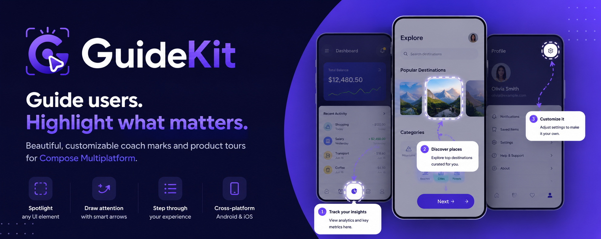

<p align="center">
  
</p>

<p align="center">
  <strong>Beautiful coach marks for Compose Multiplatform</strong>
</p>

<p align="center">
  Build polished product tours, onboarding flows, spotlight overlays, smart arrows, instruction cards, and automatic scrolling in Kotlin Compose.
</p>

<p align="center">
  <a href="https://central.sonatype.com/search?q=guidekit"></a>
  
  
  
  
</p>

<p align="center">
  
</p>

<p align="center">
  <code>Spotlight overlays</code> ·
  <code>Smart arrows</code> ·
  <code>Automatic target measurement</code> ·
  <code>Auto scrolling</code> ·
  <code>Fully customizable</code> ·
  <code>Android & iOS</code>
</p>

---

## Live Demo

<p align="center">
  
  &nbsp;&nbsp;&nbsp;
  
</p>

<p align="center">
  Both demos showcase the same core idea: GuideKit renders polished tours above your real Compose UI while your app provides measured targets and callbacks.
</p>

---

## Installation

Add GuideKit to the Compose Multiplatform source set where you want to show tours.

```kotlin
implementation("io.github.tharukack:guidekit:0.1.1")
```

For Kotlin Multiplatform projects:

```kotlin
kotlin {
    sourceSets {
        commonMain.dependencies {
            implementation("io.github.tharukack:guidekit:0.1.1")
        }
    }
}
```
---

## Quick Start

Measure a target, describe a step, and let GuideKit render the overlay.

```kotlin
@Composable
fun ProductScreen() {
    val targets = remember { mutableStateMapOf<String, Rect>() }
    var showTour by remember { mutableStateOf(true) }

    Box(Modifier.fillMaxSize()) {
        PrimaryButton(
            modifier = Modifier.onGloballyPositioned { coordinates ->
                targets["primary"] = coordinates.boundsInRoot()
            },
        )

        if (showTour) {
            GuideKit(
                steps = listOf(
                    GuideKitStep(
                        targetBounds = targets["primary"],
                        title = "Create your first item",
                        description = "Tap here to start a new workflow.",
                    ),
                ),
                onSkipped = { showTour = false },
                onFinished = { showTour = false },
            )
        }
    }
}
```

See the [`sample`](sample/) app for full configuration, styling, auto-scroll, arrow variants, rounded highlights, and circular highlights.

---

## Features

| Feature | Description |
| --- | --- |
| Coachmark overlays | Dim the screen and focus attention on the active target. |
| Smart arrows | Draw dashed or solid arrows between instruction cards and targets. |
| Rounded highlights | Match cards, panels, buttons, and custom rounded components. |
| Circular highlights | Perfect for avatars, icons, FABs, and compact controls. |
| Instruction cards | Show titles, descriptions, highlighted text, buttons, and progress. |
| Auto-scroll | Automatically scroll to keep targets visible and clear of the card. |
| Per-step customization | Override arrows, highlights, cards, labels, and scrolling per step. |
| Internal step management | GuideKit owns next, previous, skip, finish, and current step state. |
| Callbacks | React to step changes, skipped tours, and completed tours. |
| Compose Multiplatform | Shared Kotlin API for Android and iOS Compose apps. |

---

## Feature Gallery

| Highlights | Arrows | Cards |
| --- | --- | --- |
| Rounded rectangles, circles, glow strokes, borders, cutouts | Solid, dashed, curved, one-sided, two-sided | Alignment, padding, width, colors, borders, shadows |

---

## Why GuideKit

| | |
| --- | --- |
| Internal navigation | Your screen does not need to manage next/previous state. |
| Stateless host integration | Provide steps, measured bounds, and callbacks. GuideKit handles the tour UI. |
| Beautiful defaults | Drop it in and get a polished overlay without designing every detail. |
| Powerful customization | Tune each step when product UX needs precision. |
| Lightweight mental model | No navigation graph, no screen takeover, no separate overlay architecture. |

---

## Project Structure

| GuideKit owns | Host app owns |
| --- | --- |
| Step navigation | Step list |
| Highlight drawing | Target measurement |
| Arrow rendering | Visibility state |
| Instruction cards | Analytics and persistence callbacks |
| Auto-scroll calculations | Scroll callback implementation |

---

## Platform Support

| Platform | Status |
| --- | --- |
| Android | Supported |
| iOS | Supported |
| Desktop | Planned |
| Web | Planned |

---

## Documentation

| Guide | Link |
| --- | --- |
| Getting Started | [Coming soon](docs/getting-started.md) |
| Styling | [Coming soon](docs/styling.md) |
| Auto Scroll | [Coming soon](docs/auto-scroll.md) |
| Troubleshooting | [Coming soon](docs/troubleshooting.md) |
| API Reference | [Coming soon](docs/api-reference.md) |
| Sample App | [`sample/`](sample/) |

---

## Roadmap

- [x] Android support
- [x] iOS support
- [x] Rounded and circular highlights
- [x] Smart arrows
- [x] Auto-scroll
- [ ] Desktop support
- [ ] Web support
- [ ] Accessibility improvements
- [ ] Animation presets
- [ ] More sample flows

---

## Contributing

Contributions are welcome. If you want to improve GuideKit, start with a small issue, bug report, or sample enhancement.

Before opening a pull request:

```bash
./gradlew build
./gradlew allTests
```

---

## License

MIT License. See [`LICENSE`](LICENSE).

<p align="center">
  <strong>GuideKit</strong> is built for developers who want onboarding to feel native, polished, and easy to maintain.
</p>
